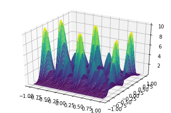
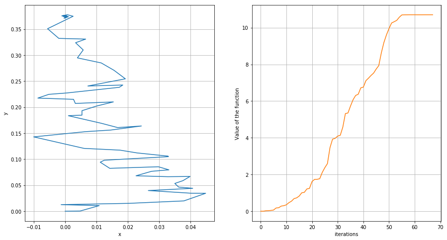
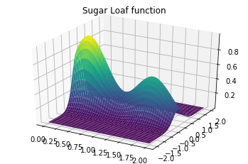

__Author:__ R. Monteiro

__Affiliation:__ Mathematics for Advanced materials - Matham-Oil, Japan

I would like to start with an example of a surface plagued with local maxima/minima. The main references I am going to use are

>Robert, Christian, and George Casella. Monte Carlo statistical methods. Springer Science & Business Media, 2013.

and the very interesting book

>Aarts, Emile, and Jan Korst. "Simulated annealing and Boltzmann machines." (1988).


```python
import numpy as np

import sympy

from sympy import *
from sympy.plotting import plot3d

import matplotlib.pyplot as plt

x, y = symbols('x y')

f = (cos(16*x)+ cos(3*x))**2*(sin(2*y)+sin(5*y))**2

plot
plot3d(f, (x, -1, 1), (y, -1, 1))

```





    <sympy.plotting.plot.Plot at 0x7f99c001fa90>


```python
So, if we run gradient descend in this problem we will probably not find the global maximum. We are going to use a different method, called "simulated annealing". The method still relies on the gradient of the function f, which we calculate below, symbolically:
```


```python
gradient = [sympy.diff(f, x), sympy.diff(f, y)]


```

We would like to find the maximum value of this function in the region $(x,y)\in [-1,1]\times [-1,1]$. 

The main point of the algorithm is to go up, but it does it with a certain probability, that changes through 'time'. In fact,the analogy of the method is not with time, but with temperature: as the temperature goes down, the probability of the algorithm going up or down changes.


```python
number_iterations = 500
T = np.linspace(1.0/(number_iterations**2),1.0/(number_iterations),number_iterations)
T = T[::-1] ### we reverse it, so that, using index as time, we decrease the temperature as time goes by


```

We shall also need to lambidify these symbolic functions, that is, we need to turn them into numpy numerical functions:


```python
f_numpy = lambdify((x,y), f, 'numpy')
```

And now we can start the implementation


```python

point= np.array([0,0]).reshape(1,2)

value_at_point = f_numpy(point[0,0],point[0,1])

def simulate(point,sigma):
    return point +sigma*np.random.randn(1,2)


#cmap = plt.get_cmap('jet_r')
seq_points =point
seq_value = value_at_point
print(value_at_point)
for i in range(number_iterations):
    next_point = simulate(point,sigma=0.01)
    value_at_next_point = f_numpy(next_point[0,0],next_point[0,1])
    Delta = value_at_next_point-value_at_point #np.float(f.evalf(subs={x:next_point[0,0],y:next_point[0,1]}) - f.evalf(subs={x:point[0,0],y:point[0,1]}))
    if (np.random.uniform()< min(np.exp(Delta/T[i]),1)):
        point = next_point
        value_at_point = value_at_next_point
        seq_points = np.concatenate((seq_points,point),axis=0)
        seq_value = np.append(seq_value,value_at_point)
        
    #colors = cmap((1.0*np.linspace(1,number_iterations,number_iterations))/number_iterations)

#colors = plt.cm.coolwarm(scaled_z)
#colors = np.linspace(0,1,np.shape(seq_points)[0])
#colors = cmap(colors)


plt.figure(figsize=(15,8))
plt.subplot(121)
color = [str(item/8.0) for item in seq_value]
plt.plot(seq_points[:,0],seq_points[:,1])
plt.xlabel('x')
plt.ylabel('y')
plt.grid(True)

plt.subplot(122)

R = seq_points.shape[0]
x = list(range(0,R))

plt.plot(x,seq_value,color='C1')
plt.xlabel('iterations')
plt.ylabel('Value of the function')
plt.grid(True)

plt.show()


```

    0.0





It behaves quite nicely, right? The technique is in fact quite useful in order to do global optimization. On the other hand, it does not use any information about the local structure of the function (like its gradient). A common thing that people do then is to combine a simulated annealing with another local search type of method.


>__Computational remark:__
>We should be careful with the algorithm that I wrote above, for it can run out of the domain I had defined initially. One can easily avoid this issue by carefully describing what the "particle" should do when it hits the boundary.

A nice exercise is the following:

>__Exercise:__ consider the following function, which we call "the sugarloaf function" (which is nothing but a representation of the real Sugar Loaf, in Rio - https://en.wikipedia.org/wiki/Sugarloaf_Mountain - a place where I lived a long time ago). 


```python
x,y = symbols("x y")
sugarloaf_2D = exp(-4*((x-.25)**2+ y**2) ) + .6*exp(-4*((x-1.5)**2+ y**2));
plot3d(sugarloaf_2D, (x, 0, 2), (y, -2, 2),title ='Sugar Loaf function')


```





    <sympy.plotting.plot.Plot at 0x7f4a5e1824a8>


>Combine local (for instance, Gradient descent) and simulated annealing (a global method) to find the local maximum of this function on the domain $(x,y) \in [0,2]\times[-2,2]$.
